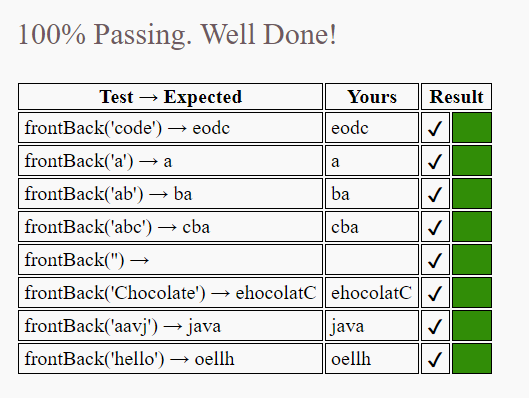
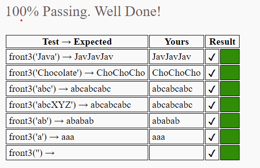
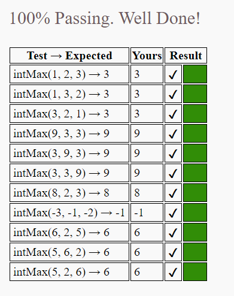
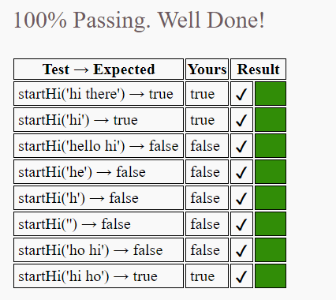
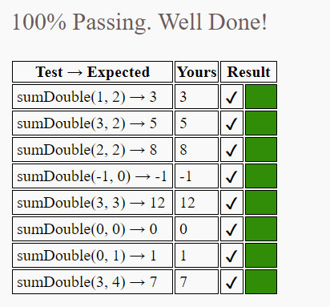
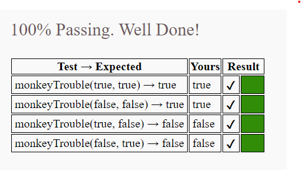
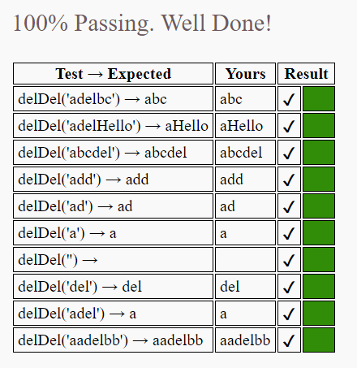
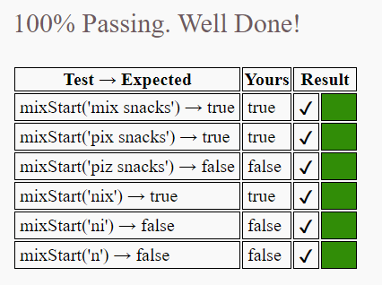

# Experiment Lab 🧪

## Objective

<i> * Perform logic exercises from the CodingJS portal! </i>

## Features

<i> * Javascript -> Structured interpreted programming language</i>

## Get started

<i> * Enter the site: <b>https://codingjs.wmcicompsci.ca/</b></i>

<i> * Choose the desired exercise</i>

<i> * Paste the respective exercise code</i>

## Result of Exercises
### Warmup 1
<strong><i>Front-Back</i></strong>

<strong><i>Front3</i></strong>

<strong><i>Int Max</i></strong>

<strong><i>Start Hi</i></strong>

<strong><i>Sum Double</i></strong>

<strong><i>Monkey Trouble</i></strong>

<strong><i>del Del</i></strong>

<strong><i>Mix Start</i></strong>

